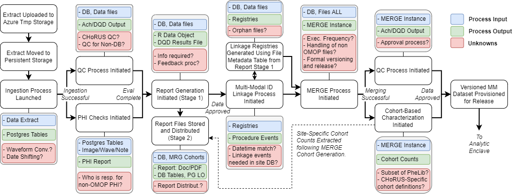

# Awaiting Approval

## 1. Purpose

This SOP provides guidelines for the central processing of data submissions within CHoRUS. It defines the procedures for ingesting, validating, merging, and preparing multi-modal datasets for analytical release, ensuring data quality and standardization across all participating sites.

---

## 2. Scope

This SOP applies to CHoRUS central processing team members, data engineers, and quality control analysts responsible for managing data submissions from participating sites. It covers the entire pipeline from initial data upload through final dataset provisioning for the analytic enclave.

---

## 3. Definitions

- **Ingestion Process**: The initial phase of receiving and processing data uploads from participating sites.
- **QC Process**: Quality control procedures including PHI checks, data validation, and completeness assessment.
- **Multi-Modal ID Linkage**: Process for linking identifiers across different data modalities (structured EHR, flowsheets, notes, waveforms, imaging).
- **MERGE Process**: Central data merging and harmonization process that combines data from multiple sites.
- **Cohort-Based Characterization**: Generation of standardized cohort definitions and population statistics.
- **ARES**: Automated Characterization of Health Information at Large-scale Longitudinal Evidence Systems output platform.

---

## 4. Roles and Responsibilities

- **Central Processing Team**: Manages the overall data processing pipeline and coordinates between processing stages.
- **Data Engineer**: Implements ingestion processes, data transformations, and technical pipeline maintenance.
- **Quality Control Analyst**: Performs PHI checks, validates data quality, and ensures compliance with CHoRUS standards.
- **Site Coordinator**: Facilitates communication with data acquisition sites and manages site-specific processing requirements.

---

## 5. Materials Needed

- Access to choruspilotstorage central repository.
- Daily Dashboard Manifest system for monitoring submissions.
- PostgreSQL database infrastructure for data storage and processing.
- DQD (Data Quality Dashboard) tools and reporting systems.
- PHI detection and validation tools.
- MERGE processing infrastructure and cohort generation tools.

---

## 6. Procedures

### 6.1. **Data Upload and Initial Processing**

1. **Extract Upload Monitoring**: Monitor choruspilotstorage for new data submissions from sites
2. **Ingestion Process Launch**: Initiate automated ingestion pipeline for approved data submissions
3. **Initial Validation**: Perform basic format and completeness checks on uploaded data files

### 6.2. **Quality Control and PHI Assessment**

1. **QC Process Initiation**: Launch comprehensive quality control procedures including:
   - Database integrity checks
   - OMOP CDM compliance validation
   - Data completeness assessment
2. **PHI Checks**: Perform automated and manual PHI detection across all data modalities:
   - Structured database tables
   - PostgreSQL large objects (images, waveforms, notes)
   - Non-OMOP file formats
3. **PHI Reporting**: Generate and distribute PHI assessment reports to responsible parties

### 6.3. **Report Generation and Distribution (Stage 1)**

1. **Initial Report Creation**: Generate preliminary data characterization reports including:
   - Data volume and completeness metrics
   - DQD results and data quality assessments
   - Site-specific data profiling
2. **File Metadata Generation**: Create linkage registries using file metadata tables
3. **Report Storage and Distribution**: Store reports in designated repositories and distribute to stakeholders

### 6.4. **Multi-Modal ID Linkage Processing**

1. **Linkage Registry Generation**: Create comprehensive linkage registries across data modalities:
   - Person ID linkages
   - Visit occurrence linkages
   - Temporal alignment verification
2. **Cross-Modal Validation**: Verify datetime matching and linkage consistency across:
   - Structured EHR data
   - Flowsheet data
   - Clinical notes
   - Waveform data
   - Medical imaging
3. **Orphan File Management**: Identify and process files without clear linkage relationships

### 6.5. **MERGE Process Implementation**

1. **MERGE Instance Creation**: Initialize multi-site data merging process including:
   - Site-specific cohort harmonization
   - Standardized variable mapping
   - Temporal alignment across sites
2. **Data Integration**: Combine data across participating sites while maintaining:
   - Patient privacy protections
   - Site anonymization
   - Data quality standards
3. **Execution Frequency Management**: Coordinate regular MERGE updates and incremental processing

### 6.6. **Final QC and Cohort Characterization**

1. **Post-MERGE Quality Control**: Perform final validation on merged datasets
2. **Cohort-Based Characterization**: Generate standardized population characterizations:
   - Site-specific cohort counts
   - CHoRUS-specific cohort definitions
   - PheLib phenotype subset analysis
3. **ARES Output Preparation**: Format data for ARES platform integration

### 6.7. **Dataset Versioning and Release**

1. **Formal Versioning**: Apply version control to final multi-modal datasets
2. **Release Approval**: Obtain necessary approvals for dataset release
3. **Analytic Enclave Provisioning**: Deploy versioned datasets to secure analytic environment

---

## 7. Quality Control (QC) Procedures

- **Daily Monitoring**: Review Daily Dashboard Manifest for submission status and processing alerts
- **Multi-Stage Validation**: Implement quality checks at each processing stage (ingestion, PHI, MERGE, characterization)
- **Site Communication**: Conduct regular 1-on-1 meetings with sites to address processing issues
- **Error Documentation**: Maintain comprehensive logs of processing errors and resolution steps
- **Performance Metrics**: Track processing times, success rates, and data quality indicators

---

## 8. Documentation and Storage

- Maintain processing logs for all pipeline stages and data transformations
- Document site-specific processing requirements and customizations
- Store intermediate processing results for troubleshooting and validation
- Version control all processing scripts and configuration files
- Archive final reports and characterization outputs

---

## 9. Deviations from the SOP

- Any deviations from standard processing procedures must be documented and approved by CHoRUS central processing leadership
- Site-specific processing modifications require documentation and validation
- Emergency processing procedures must be logged and reviewed post-completion

---

## 10. Revision History

| Version | Date       | Description                                |
|---------|------------|--------------------------------------------|
| 1.0     | 2025-09-26 | Initial version based on central processing workflow |

