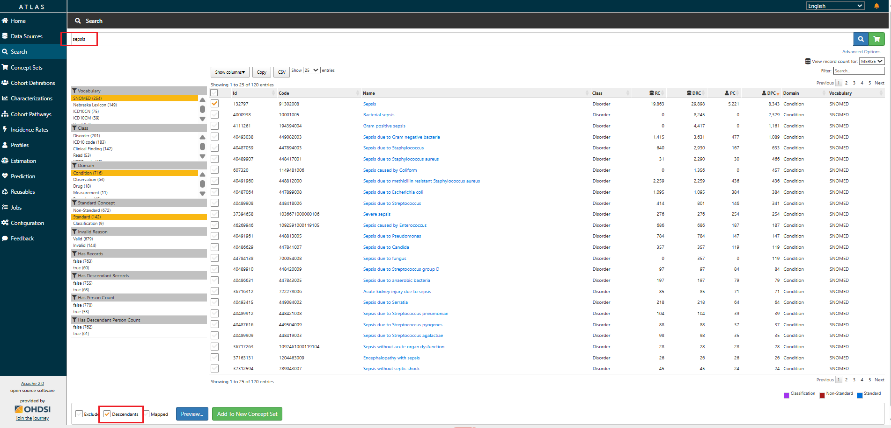
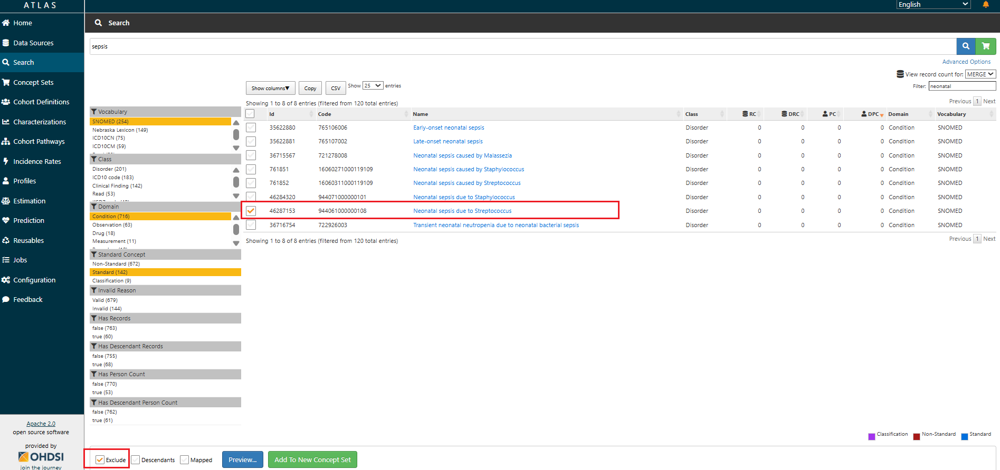
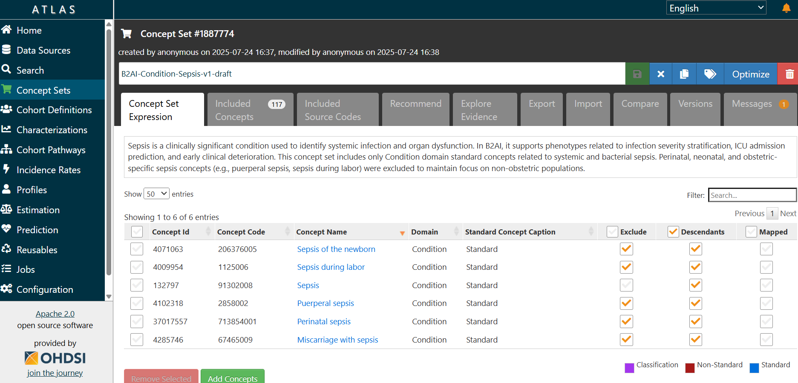

# Awaiting Approval
# Standard Operating Protocol: Concept Set Creation for Selected Data Elements in OHDSI Atlas

## Purpose

This SOP provides standardized instructions for creating, reviewing, and managing Concept Sets in [B2AI OHDSI Atlas](https://ca-chorus-www-dgs.ashymoss-446baac1.eastus2.azurecontainerapps.io/atlas/#/home) for selected data elements (e.g., measurements, conditions, drugs, procedures, observations) from [Tier 1](https://docs.google.com/document/d/1_Cs5jx_SFv4TjtD0-nx0te0wmIhPsfsaUFE4lJHJIB8/edit?tab=t.0). Concept sets (also referred to as conceptsets or codesets) are curated, reusable semantic groupings of OMOP standard or classification concepts that operationalize a specific clinical idea or research variable. A concept set may include a single concept or multiple related concepts, depending on how the idea is represented in the vocabulary. They are used to operationalize meaning within the OMOP CDM framework, supporting cohort definitions, phenotype algorithms, and analytic queries.

## Scope

This SOP applies to all activities involving the definition, creation, validation, and maintenance of concept sets in OHDSI Atlas for use within the OMOP CDM. It encompasses cohort development, phenotype construction, variable standardization, and the reuse of concept sets across observational research and analytics.

### Applicable Roles and Responsibilities

This SOP is intended for the following roles:
- **Data Scientists**: may serve as the primary concept set creators at contributing sites. They translate clinical definitions into executable logic, select appropriate OMOP standard concepts, and ensure consistency with study goals and modeling strategies.
- **Data Analysts**: may create concept sets to support cohort logic, inclusion/exclusion criteria, and study endpoints. They ensure that the selected concepts align with study protocols and analytic frameworks. 
- **Vocabulary Specialists**: may create or review concept sets with a focus on ensuring the use of standard concepts, domain correctness, vocabulary integrity, and semantic alignment. They play a key role in validating and refining concept sets before use.
- **Study Designers and Epidemiologists**: may initiate concept set creation to operationalize research definitions and phenotypes. Their contributions focus on ensuring conceptual clarity and consistency with clinical objectives and study design.
- **Subject Matter Experts (Clinicians at Contributing Sites)**: may participate in the creation or review of concept sets by contributing real-world clinical knowledge, identifying edge cases, and ensuring terminology reflects site-specific documentation and clinical nuance.

All roles are expected to adhere to the procedures outlined in this SOP to promote consistency, reusability, and semantic interoperability within and across research studies.

## Glossary

| Term                 | Definition |
|----------------------|------------|
| **Concept Set**      | A named and versioned set of one or more OMOP standard concepts used to define inclusion/exclusion logic in a cohort or analysis. |
| **Data Element**     | A meaningful clinical unit (e.g., lab test, diagnosis, medication) used as a building block in defining phenotypes, cohort criteria, and analytic variables in OHDSI Atlas.|
| **OHDSI Atlas**      | A web-based platform for cohort and concept set design using OMOP CDM and OHDSI Standardized Vocabularies. |
| **Standard Concept** | A concept in the OMOP CDM vocabulary where the standard_concept field is set to 'S' in the CONCEPT table. Standard concepts serve as the target for mapping source codes and are used for creating concept sets and conducting standardized analyses across datasets. |
| **Concept Set Expression** | The logic that defines which standard concepts are included in a concept set, based on user-selected concepts, use of `Descendants`, and `Exclude` flags. It determines the final semantic scope of the concept set used in cohort logic. |
| **Included Concepts** | The resolved list of all standard concepts included in a concept set, after applying descendants and exclusions from the Concept Set Expression. These are the actual concept IDs used in cohort generation and analysis. |
| **Included Source Codes** | The list of non-standard source codes (e.g., ICD-10, CPT4) that are mapped to the included standard concepts. Useful for understanding what upstream source codes will be captured by the concept set. |
| **RC (Record Count)** | The number of individual records in the OMOP CDM that are mapped directly to the selected concept. This reflects how frequently that specific concept (without descendants) appears across CDM tables. |
| **DRC (Descendant Record Count)** | The number of records in the CDM mapped to the selected concept and all of its descendant concepts in the vocabulary hierarchy. This value provides a broader measure of how often the clinical idea represented by the parent concept appears in the data. |
| **PC (Person Count)** | The number of distinct persons in the CDM who have at least one record coded with the selected concept (without descendants). This helps estimate how many unique patients are directly associated with the concept. |
| **DPC (Descendant Person Count)** | The number of distinct persons in the CDM who have at least one record coded with the selected concept or any of its descendants. This shows the overall patient population that could be captured when the concept is used with the “include descendants” option. |
| **Optimize** | A utility in the Concept Set Expression editor that removes unnecessary child concepts when a parent concept is included with `Descendants`, simplifying the expression without changing the underlying concept inclusion. |
| **Descendants Checkbox** | A flag in ATLAS used during concept selection to automatically include all semantic children of the selected concept based on vocabulary hierarchies. |
| **Exclude Checkbox** | A flag used to remove a concept (and optionally its descendants) from a concept set, typically used to refine broad inclusions or remove off-target concepts. |
| **Cohort Definition** | A structured, logic-based specification in ATLAS used to identify a group of persons who meet specific criteria over time, using one or more concept sets. |
| **Phenotype (computable)** | A structured algorithm that identifies individuals in health data who meet specific clinical criteria. These criteria are typically expressed using diagnosis codes, procedures, drug exposures, measurements, observations, and temporal relationships, allowing the algorithm to be executed on standardized datasets. |
| **Phenotype (OHDSI)** | A computable clinical definition developed using OHDSI tools (e.g., ATLAS) and OMOP CDM conventions to ensure consistency, transparency, and reproducibility across data sources. It includes standardized concept sets, logic for defining patient inclusion/exclusion, temporal constraints, and optional validation artifacts. |
| **Phenotype (biological)** | The observable physical, physiological, biochemical, or behavioral traits of an organism resulting from the interaction between its genotype and environmental exposures. This definition is included solely for disambiguation purposes and is not applicable to OMOP/OHDSI-based phenotyping workflows. |

## Responsibilities

| Role                | Responsibilities |
|---------------------|------------------|
| **Concept Set Author**     | Creates and curates concept sets following this SOP. |
| **Reviewer / Validator**   | Reviews concept sets for semantic accuracy and reusability. |
| **Standards Team (with a Vocabulary expert)** | Approves new or updated concept sets and ensures compliance with vocabulary and standards governance. |
| **Atlas Admin**            | Maintains OHDSI Atlas access and manages user roles. |

## Prerequisites

- Access to a running CHoRUS B2AI instance of OHDSI Atlas with vocabulary data loaded (including custom vocabularies) and assigned authoring rights.    
- Familiarity with OMOP CDM, standard vocabulary structure, and domain-specific logic.  

## Concept Set Creation Workflow

### Step 1: Define the Clinical Intent

- Select the data element to represent from the [Phenotype-based list of data elements - Tier 1 Justification](https://docs.google.com/document/d/1_Cs5jx_SFv4TjtD0-nx0te0wmIhPsfsaUFE4lJHJIB8/edit?tab=t.0).
- Define the Clinical Justification in the document if it has not yet been provided.

### Step 2: Search for Standard Concepts in Atlas

- Access [B2AI OHDSI Atlas](https://ca-chorus-www-dgs.ashymoss-446baac1.eastus2.azurecontainerapps.io/atlas/#/home) and select the `Search` tab from the main navigation.
- Enter the data element into the Atlas search bar (note: the search is character-sensitive).
> Alternatively, use the [OHDSI Athena browser](https://athena.ohdsi.org/search-terms/terms) to explore specific concept names and IDs - Athena offers more flexible search capabilities and may be more effective for identifying exact matches. Once identified, you can copy the relevant concept IDs into Atlas.
- Click the **Search** button.
> Tip: Instead of manually searching and selecting concepts, you can type a concept name and click the **Shopping Cart** button. Atlas will add the selected concept automatically into the Concept Set Expression. This can be useful at the start of concept set creation to quickly capture candidate terms, though you should still review and refine them afterward.
- Use filters by `standard concept`, `domain` (e.g., Condition, Drug), and `vocabulary` (e.g., SNOMED, RxNorm) to narrow down the list of returned concepts.
> Tip: Selecting the correct domain for concepts ensures that your concept set is properly aligned with downstream cohort definitions and analytic workflows. If you are uncertain, check the OMOP [CDM v5.4 specification](https://ohdsi.github.io/CommonDataModel/cdm54.html#Current_Support_for_CDM_v54), revisit the [respective office hours session](https://drive.google.com/drive/u/4/folders/1iSl3ZZmZYq5i8wLoJq5S3NIrdh9NXHkX), or consult [the helper table](https://github.com/chorus-ai/Chorus_SOP/blob/review-concept-set-creation/sop-website/docs/Concept-Set-Creation/OMOP-Domain-Definition.mdx) for additional information.
- To determine which concepts are most relevant for your data element, review the record/patient count (RC/PC) and descendant record/patient count (DRC/DPC) columns.
- A practical approach is to order results by DRC to identify the concepts (often higher-level parents) that are most prevalent in the dataset, and then refine by excluding unrelated descendants.
- Combine this prevalence-based check with your clinical knowledge and project requirements to select the most appropriate concept(s).

### Step 3: Add Concepts to the Concept Set Expression with Attention to Descendants, Exclusions and Source Codes

- Select checkboxes next to standard concepts that accurately represent your data element.
> Example, if your data element is Sepsis, search for "Sepsis" in the Condition domain and select the Standard concept.
- Use the `Descendants` checkbox to include all semantic children of the selected concept. This allows you to automatically include more specific subtypes or variations of the concept, based on the concept hierarchy.
> Example: Checking `Descendants` for the concept Sepsis will include specific types like `Gram positive sepsis`, `Sepsis due to Streptococcus`, etc.

- Use the `Exclude` checkbox to subtract concepts you do not want included in the concept set or both `Exclude` and `Descendants` to exclude entire branches. This is useful if a child concept is too broad, irrelevant, or contradicts the intended definition. 

- Once you have selected the desired concepts, click the `Add to Concept Set` button to include them. 
- Then click the `Concept Set` tab. If concepts have been added, the shopping cart icon and the tab label will appear in red. In this tab, you can review the `Concept Set Expression`, including all included and intentionally excluded concepts.
- Click on `Included Concepts` to review the final list of included concepts (with descendants and exclusions applied). This step allows you to 1) verify what is actually included in the concept set; 2) manually remove or exclude any remaining unwanted concepts; 3) catch edge cases that may have been automatically pulled in via descendants.
- Then, under the `Included Concepts` section, use the `Exclude` checkbox to remove any concepts that are not relevant to your target population. 
> Example: If you are creating a concept set for Sepsis cases unrelated to pregnancy, childbirth, or the neonatal period, use the `Exclude` checkbox to remove concepts not relevant to the intended population, such as:  `Sepsis of the newborn` (4071063), `Perinatal sepsis` (37017557), `Puerperal sepsis` (4102318), `Sepsis during labor` (4009954), `Miscarriage with sepsis` (4285746).
> Tip: This is where you confirm the effect of your inclusion/exclusion logic, and where most common mistakes are caught.
- After defining your concept set, switch to the 'Included Source Codes' tab. Here you can 1) compare captured codes against those reported in the literature or clinical guidelines; 2) ensure no important source codes are missing, particularly those frequently used at your site.
> Tip: Avoid mixing standard and source codes inappropriately within the same concept set expression and attempting to exclude source codes with the Exclude flag (this does not work in Atlas).
- After you have created a draft concept set, the 'Recommend' tab can suggest additional related concepts you may not have considered. Review all suggested concepts carefully before including them, as the algorithm may also surface terms that are clinically irrelevant or outside your intended scope.
- Click `Save` to store your concept set.

### Step 4: Apply Naming Convention to the Concept Set
- Return to the `Concept Set Expression` section.
- Enter the Concept Set name in the white input field at the top of the screen and click `Save`. Use the following naming format to ensure consistency across the project:

`Project Name`-`OMOP Domain`-`Data Element Name`-`Version`-`Status Tag`

#### Recommended Naming Elements

| Element        | Example |
|----------------|---------|
| Project Name   | B2AI |
| Domain         | Condition, Meas/Obs, Measurement, Drug/Device, Procedure, Observation |
| Data Element   | Serum creatinine, Anticonvulsants, Sepsis, Atrial Fibrillation |
| Version        | v1, v1.2, v2 |
| Status Tag     | `draft`, `pending validation`, `validated` |

**Examples**:

- `B2AI`-`Condition`-`Sepsis`-`v1`-`draft`  
- `B2AI`-`Measurement`-`Serum Sodium`-`v2`-`validated`

#### Versioning Guidance
- **Major version change (v1 → v2):**  
  Apply when the logic of the concept set changes in a way that could alter the clinical definition or analytic results:
  - Adding or removing a concept  
  - Changing descendant or exclusion logic  
  - Switching to a different domain concept  
- **Minor version change (v1.0 → v1.1):**  
  Apply when only metadata or supporting details are updated, but the underlying logic remains the same: 
  - Refining the clinical justification text  
  - Correcting typos or formatting  
- **Status Tag:** Moves independently of versioning to reflect review stage (e.g., `draft` → `pending validation` → `validated`).  
> Example: `B2AI-Condition-Sepsis-v1-draft` → [update applied] → `B2AI-Condition-Sepsis-v2-pending validation` → [review completed] → `B2AI-Condition-Sepsis-v2-validated`
- **Rules**: 
  - Each update to a concept set must be reflected by updating the concept set name to a new version.
  - Do not create a new concept set for minor or major revisions. Instead, rename the existing one to reflect the new version.

### Step 5: Optimize, Document and Save
- Click the `Optimize` button (top-right corner of the screen, if available). This will remove redundant child concepts that are already covered by a parent with Descendants checked, simplifying the expression logic and making it easier to manage.
> Note: Optimization ensures a cleaner concept set expression but does not change the underlying list of included concepts used for cohort logic.
- In the `Concept Set Expression` tab, locate the input field labeled "Enter the concept set description here".
- Enter a clear and concise concept set description, including but not limited to a Clinical Justification.
> Example: "Sepsis is a clinically significant condition used to identify systemic infection and organ dysfunction. In B2AI, it supports phenotypes related to infection severity stratification, ICU admission prediction, and early clinical deterioration. This concept set includes only Condition domain standard concepts related to systemic and bacterial sepsis. Perinatal, neonatal, and obstetric-specific sepsis concepts (e.g., puerperal sepsis, sepsis during labor) were excluded to maintain focus on non-obstetric populations."

- After final review, click `Save`.
- Once the concept set is finalized and saved, close it and navigate to the "Concept Sets" tab. Find the concept set you created, copy its ID, and paste it into the "Concept Set ID" field in the table of [Phenotype-based list of data elements - Tier 1 Justification](https://docs.google.com/document/d/1_Cs5jx_SFv4TjtD0-nx0te0wmIhPsfsaUFE4lJHJIB8/edit?tab=t.0) document.

### Step 6: Register Concept Set in the Inventory Catalog

Log the new concept set in the [**Concept Set Inventory**](https://docs.google.com/spreadsheets/d/1Oq5DoQ48Ruqussl__mmfT5ttDV3nfASYm154Gy-S8us/edit?usp=sharing) (shared institutional Google spreadsheet), including:

- Concept Set ID  
- Concept Set Name  
- Data Element Covered  
- Author(s)  
- Date Created  
- Atlas URL  
- Vocabulary Version
- Review Status  
- Date Reviewed  
- Reviewer Name  
- Notes on logic  

### Step 7: Review and Validation

- Assign a reviewer (vocabulary expert / subject domain expert).
- Reviewer checks:
  - ✅ Concepts added (no gaps or redundancies)  
  - ✅ Standardness  
  - ✅ Descendants used appropriately  
  - ✅ Unwanted concepts excluded  
  - ✅ Domain alignment  
  - ✅ Concept Set Description is filled out and includes a clear Clinical Justification
  - ✅ Registration in Concept Set Inventory  

Reviewer documents the review outcome in the Concept Set Inventory (fields: Review Status, Date Reviewed, Reviewer Name, Notes on logic if needed).

#### Common Pitfalls to Avoid

- Including non-standard concepts.
- Using concepts from the wrong domain.
- Missing descendants.
- Overly broad sets without exclusions.
- Not versioning or documenting updates.
- Including both children and parents in the concept set expression simultaneously.

### Step X: Importing and Exporting Concept Sets in Atlas

Atlas supports several methods for transferring concept sets between environments. 

#### Import Options
The choice depends on whether you want to **recreate**, **enrich**, or **fully reproduce** a concept set.
- **Concept Identifiers:** Paste one or more Concept IDs (e.g., `132797` for Sepsis).  
  - Multiple IDs should be separated by commas (no spaces).  
  - Useful for quick reconstruction from documentation or spreadsheets.  
- **Source Codes:** Enter raw source codes (ICD, CPT, etc.) for Atlas to resolve to standard concepts.  
  - Useful when importing directly from site-specific code lists.  
- **Concept Set Expression JSON:** Paste a full JSON representation of a concept set.  
  - Preserves descendants, exclusions, and optimization flags.  
  - Recommended for transferring validated or finalized sets across environments.  
- **Repository (Copy Existing):** Select an existing concept set in Atlas and copy it as a starting point.  
  - Useful for reusing or adapting previously curated sets.  

#### After Importing (All Methods)
Once a concept set is imported into Atlas, continue with the standard workflow:
1. Go to **`Concept Set Expression`** to review the logic.  
2. Click **`Included Concepts`** to validate the resolved list.  
   - Check for unintended inclusions from descendants.  
   - Manually exclude or remove irrelevant terms.  
3. Click **`Included Source Codes`** to confirm coverage of site-specific codes and compare against published code lists or literature.  
   - Avoid mixing source and standard codes in the expression.  
   - Remember: the `Exclude` checkbox does **not** exclude source codes.  
4. Use **`Optimize`** (if available) to simplify the expression by removing redundant child concepts already covered by parent + descendants. A concept set may already appear optimized, but there is no way to be certain without running the function - so always apply it to confirm.
5. Enter **Concept Set Name** and a **Concept Set Description** including the clinical justification.  
6. Click **`Save`** and register the concept set in the Concept Set Inventory.

#### Export Options
- **Concept Set Expression JSON:** Exports the full expression, including descendants, exclusions, and annotations.  
  - Best for sharing validated sets across sites or environments.  
- **Concept Identifier List:** Exports only the IDs from the expression.  
  - Useful for lightweight documentation or sharing minimal lists.  
- **Included Concept Identifier List:** Exports the fully resolved set of included concepts (with descendants).  
  - Useful for validation, review, and cross-checking against literature or source data.  

## Resources and References
- [Book of OHDSI. Chapter 8 OHDSI Analytics Tools](https://ohdsi.github.io/TheBookOfOhdsi/OhdsiAnalyticsTools.html)
- [OHDSI Wiki – Concept Sets](https://www.ohdsi.org/web/wiki/doku.php?id=documentation:software:atlas:concept_sets)
- [FINNGEN Atlas Guide](https://docs.finngen.fi/working-in-the-sandbox/which-tools-are-available/atlas/detailed-guide/how-to-define-a-cohort-in-atlas/concept-sets) 
- [ATLAS Tutorial: Overview of ATLAS](https://www.youtube.com/watch?v=dr9FhEkf04o)
- [ATLAS Tutorial: Explore Concept Sets](https://www.youtube.com/watch?v=mfjxNwn3KkM)
- [ATLAS Tutorial: Create New Concept Sets](https://www.youtube.com/watch?v=2_JsAAFExMU)
- [2024 OHDSI Europe Symposium Vocabulary Tutorial (Session 1 of 2)](https://www.youtube.com/watch?v=gHPWMzzx6z8)
- [2024 OHDSI Europe Symposium Vocabulary Tutorial (Session 2 of 2)](https://www.youtube.com/watch?v=Z94DStbr3So&t=520s)
