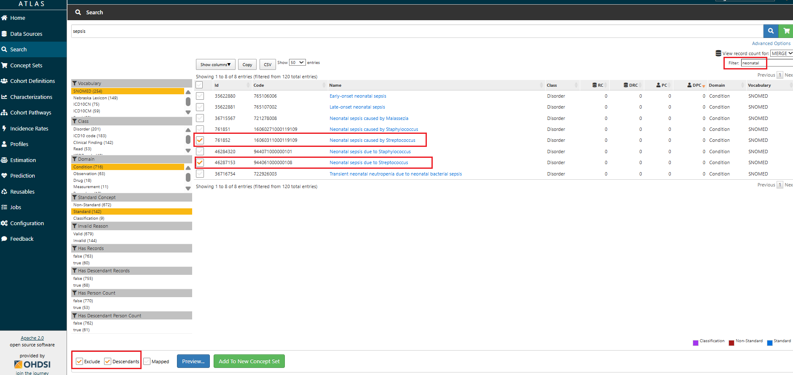

# Awaiting Approval
# Standard Operating Protocol: Concept Set Creation for Selected Data Elements in OHDSI Atlas

## Purpose

This SOP provides standardized instructions for creating, reviewing, and managing Concept Sets in [B2AI OHDSI Atlas](https://ca-chorus-www-dgs.ashymoss-446baac1.eastus2.azurecontainerapps.io/atlas/#/home) for selected data elements (e.g., measurements, conditions, drugs, procedures, observations) from [Tier 1](https://docs.google.com/document/d/1_Cs5jx_SFv4TjtD0-nx0te0wmIhPsfsaUFE4lJHJIB8/edit?tab=t.0). Concept sets are curated, reusable semantic groupings of OMOP standard concepts that operationalize a specific clinical idea or research variable for use in cohort definitions, phenotype algorithms, or analytic queries within the OMOP CDM framework.

## Scope

This SOP applies to all activities involving the definition, creation, validation, and maintenance of concept sets in OHDSI Atlas for use within the OMOP CDM. It encompasses cohort development, phenotype construction, variable standardization, and the reuse of concept sets across observational research and analytics.

### Applicable Roles and Responsibilities

This SOP is intended for the following roles:
- **Data Scientists**: may serve as the primary concept set creators at contributing sites. They translate clinical definitions into executable logic, select appropriate OMOP standard concepts, and ensure consistency with study goals and modeling strategies.
- **Data Analysts**: may create concept sets to support cohort logic, inclusion/exclusion criteria, and study endpoints. They ensure that the selected concepts align with study protocols and analytic frameworks. 
- **Vocabulary Specialists**: may create or review concept sets with a focus on ensuring the use of standard concepts, domain correctness, vocabulary integrity, and semantic alignment. They play a key role in validating and refining concept sets before use.
- **Study Designers and Epidemiologists**: may initiate concept set creation to operationalize research definitions and phenotypes. Their contributions focus on ensuring conceptual clarity and consistency with clinical objectives and study design.
- **Subject Matter Experts (Clinicians at Contributing Sites)**: may participate in the creation or review of concept sets by contributing real-world clinical knowledge, identifying edge cases, and ensuring terminology reflects site-specific documentation and clinical nuance.

All roles are expected to adhere to the procedures outlined in this SOP to promote consistency, reusability, and semantic interoperability within and across research studies.

## Glossary

| Term                 | Definition |
|----------------------|------------|
| **Concept Set**      | A named and versioned set of one or more OMOP standard concepts used to define inclusion/exclusion logic in a cohort or analysis. |
| **Data Element**     | A meaningful clinical unit (e.g., lab test, diagnosis, medication) used as a building block in defining phenotypes, cohort criteria, and analytic variables in OHDSI Atlas.|
| **OHDSI Atlas**      | A web-based platform for cohort and concept set design using OMOP CDM and OHDSI Standardized Vocabularies. |
| **Standard Concept** | A concept in the OMOP CDM vocabulary where the standard_concept field is set to 'S' in the CONCEPT table. Standard concepts serve as the target for mapping source codes and are used for creating concept sets and conducting standardized analyses across datasets. |
| **Concept Set Expression** | The logic that defines which standard concepts are included in a concept set, based on user-selected concepts, use of `Descendants`, and `Exclude` flags. It determines the final semantic scope of the concept set used in cohort logic. |
| **Included Concepts** | The resolved list of all standard concepts included in a concept set, after applying descendants and exclusions from the Concept Set Expression. These are the actual concept IDs used in cohort generation and analysis. |
| **Included Source Codes** | The list of non-standard source codes (e.g., ICD-10, CPT4) that are mapped to the included standard concepts. Useful for understanding what upstream source codes will be captured by the concept set. |
| **Optimize** | A utility in the Concept Set Expression editor that removes unnecessary child concepts when a parent concept is included with `Descendants`, simplifying the expression without changing the underlying concept inclusion. |
| **Descendants Checkbox** | A flag in ATLAS used during concept selection to automatically include all semantic children of the selected concept based on vocabulary hierarchies. |
| **Exclude Checkbox** | A flag used to remove a concept (and optionally its descendants) from a concept set, typically used to refine broad inclusions or remove off-target concepts. |
| **Cohort Definition** | A structured, logic-based specification in ATLAS used to identify a group of persons who meet specific criteria over time, using one or more concept sets. |
| **Phenotype (computable)** | A structured algorithm that identifies individuals in health data who meet specific clinical criteria. These criteria are typically expressed using diagnosis codes, procedures, drug exposures, measurements, observations, and temporal relationships, allowing the algorithm to be executed on standardized datasets. |
| **Phenotype (OHDSI)** | A computable clinical definition developed using OHDSI tools (e.g., ATLAS) and OMOP CDM conventions to ensure consistency, transparency, and reproducibility across data sources. It includes standardized concept sets, logic for defining patient inclusion/exclusion, temporal constraints, and optional validation artifacts. |
| **Phenotype (biological)** | The observable physical, physiological, biochemical, or behavioral traits of an organism resulting from the interaction between its genotype and environmental exposures. This definition is included solely for disambiguation purposes and is not applicable to OMOP/OHDSI-based phenotyping workflows. |

## Responsibilities

| Role                | Responsibilities |
|---------------------|------------------|
| **Concept Set Author**     | Creates and curates concept sets following this SOP. |
| **Reviewer / Validator**   | Reviews concept sets for semantic accuracy and reusability. |
| **Standards Team (with a Vocabulary expert)** | Approves new or updated concept sets and ensures compliance with vocabulary and standards governance. |
| **Atlas Admin**            | Maintains OHDSI Atlas access and manages user roles. |

## Prerequisites

- Access to a running CHoRUS B2AI instance of OHDSI Atlas with vocabulary data loaded (including custom vocabularies) and assigned authoring rights.    
- Familiarity with OMOP CDM, standard vocabulary structure, and domain-specific logic.  

## Concept Set Creation Workflow

### Step 1: Define the Clinical Intent

- Select the data element to represent from the [Phenotype-based list of data elements - Tier 1 Justification](https://docs.google.com/document/d/1_Cs5jx_SFv4TjtD0-nx0te0wmIhPsfsaUFE4lJHJIB8/edit?tab=t.0).
- Define the Clinical Justification in the document if it has not yet been provided.

### Step 2: Search for Standard Concepts in Atlas

- Access [B2AI OHDSI Atlas](https://ca-chorus-www-dgs.ashymoss-446baac1.eastus2.azurecontainerapps.io/atlas/#/home) and select the “Search” tab from the main navigation.
- Enter the data element into the Atlas search bar (note: the search is character-sensitive).
> Alternatively, use the [OHDSI Athena browser](https://athena.ohdsi.org/search-terms/terms) to explore specific concept names and IDs - Athena offers more flexible search capabilities and may be more effective for identifying exact matches. Once identified, you can copy the relevant concept IDs into Atlas.
- Click the **Search** button.
- Use filters by `standard concept`, `domain` (e.g., Condition, Drug), and `vocabulary` (e.g., SNOMED, RxNorm) to narrow down the list of returned concepts and focus your search on the most relevant standard terms for your data element.

### Step 3: Add Concepts to the Concept Set Expression with Attention to Descendants and Exclusions

- Select checkboxes next to standard concepts that accurately represent your data element.
> Example, if your data element is Sepsis, search for "Sepsis" in the Condition domain and select the Standard concept.
- Use the `Descendants` checkbox to include all semantic children of the selected concept. This allows you to automatically include more specific subtypes or variations of the concept, based on the concept hierarchy.
> Example: Checking `Descendants` for the concept Sepsis will include specific types like `Puerperal sepsis`, `Sepsis-associated left ventricular failure`, etc.

- Use the `Exclude` checkbox to subtract concepts you do not want included in the concept set. This is useful if a child concept is too broad, irrelevant, or contradicts the intended definition.
> Example: If you are creating a concept set for Sepsis cases unrelated to pregnancy, childbirth, or the neonatal period, start by selecting the parent concept `Sepsis` (Concept ID: 132797) and enable the `Descendants` checkbox to include related subtypes. Then, use the `Exclude` checkbox to remove concepts not relevant to the intended population, such as: `Sepsis of the newborn` (4071063), `Perinatal sepsis` (37017557), `Puerperal sepsis` (4102318), `Sepsis during labor` (4009954), `Miscarriage with sepsis` (4285746).

 

- Click the “Concept Set” tab (added concepts appear in red).
  
  

- After adding concepts to the set, go to the `Concept Set` tab, then click on `Included Concepts` to review the final list of included concepts (with descendants and exclusions applied). This step allows you to 1) Verify what is actually included in the concept set; 2) Manually remove or exclude any remaining unwanted concepts; 3) Catch edge cases that may have been automatically pulled in via descendants.
> Tip: This is where you confirm the effect of your inclusion/exclusion logic, and where most common mistakes are caught.
- Click the `Optimize` button (if available) in the `Concept Set Expression` section. This will remove redundant child concepts that are already covered by a parent with Descendants checked, simplifying the expression logic and making it easier to manage.
> Note: Optimization ensures a cleaner concept set expression but does not change the underlying list of included concepts used for cohort logic.
- After optimization and final review, click `Save` to store your concept set.

### Step 4: Apply Naming Convention to the Concept Set
Enter the Concept Set name in the white input field at the top of the screen, just below the Concept Set ID and above the tab navigation (Expression, Included Concepts, etc.).
Use the following naming format to ensure consistency across the project:

`Project Name` - `OMOP Domain` - `Data Element Name` - `Version` - `Status Tag`

#### Recommended Naming Elements

| Element        | Example |
|----------------|---------|
| Project Name   | B2AI |
| Domain         | Condition, Meas/Obs, Measurement, Drug/Device, Procedure, Observation |
| Data Element   | Serum creatinine, Anticonvulsants, Sepsis, Atrial Fibrillation |
| Version        | v1, v1.2, v2 |
| Status Tag     | `draft`, `pending validation`, `validated` |

**Examples**:

- `B2AI`- `Condition` - `Sepsis` - `v1` - `draft`  
- `B2AI` - `Measurement` - `Serum Sodium` - `v2` - `validated`

### Step 5: Document and Save

- In the Concept Set Expression tab, locate the input field labeled "Enter the concept set description here" (just above the concept list tabs like Included Concepts and Included Source Codes).
- Enter a clear and concise concept set description, including but not limited to a Clinical Justification.
> Example: “Serum sodium is a routinely measured lab value used to assess hydration status, kidney function, and electrolyte imbalance. In B2AI, it supports phenotypes related to fluid imbalance and early detection of acute kidney injury. This concept set includes only Measurement domain concepts. Non-serum, non-blood (e.g., urine sodium) and non-standard entries were excluded to ensure consistency across sites.”

  
  
- Click **Save**.

### Step 6: Register Concept Set in the Inventory Catalog

Log the new concept set in the [**Concept Set Inventory**](https://docs.google.com/spreadsheets/d/1Oq5DoQ48Ruqussl__mmfT5ttDV3nfASYm154Gy-S8us/edit?usp=sharing) (shared institutional Google spreadsheet), including:

- Concept Set ID  
- Concept Set Name  
- Data Element Covered  
- Author(s)  
- Date Created  
- Atlas URL  
- Review Status  
- Date Reviewed  
- Reviewer Name  
- Notes on logic  

### Step 7: Review and Validation

- Assign a reviewer (vocabulary expert / subject domain expert).
- Reviewer checks:
  - ✅ Concepts added (no gaps or redundancies)  
  - ✅ Standardness  
  - ✅ Descendants used appropriately  
  - ✅ Unwanted concepts excluded  
  - ✅ Domain alignment  
  - ✅ Concept Set Description is filled out and includes a clear Clinical Justification
  - ✅ Registration in Concept Set Inventory  

Reviewer documents the review outcome in the Concept Set Inventory (fields: Review Status, Date Reviewed, Reviewer Name, Notes on logic if needed).

#### Common Pitfalls to Avoid

- Including non-standard concepts.
- Using concepts from the wrong domain.
- Missing descendants.
- Overly broad sets without exclusions.
- Not versioning or documenting updates.
- Including both children and parents in the concept set expression simultaneously.

## Versioning

Each major update to a concept set—such as adding or removing concepts, changing inclusion/exclusion logic, or modifying descendant flags - **must be reflected by updating the concept set name to a new version**.

> **Do not create a new concept set for minor or major revisions.** Instead, rename the existing one to reflect the new version.
> Example: `Condition - Sepsis - v1 - draft` → [update applied] → `Condition - Sepsis - v2 - pending validation` → [review completed] → `Condition - Sepsis - v2 - validated`

## Resources and References
- [Book of OHDSI. Chapter 8 OHDSI Analytics Tools](https://ohdsi.github.io/TheBookOfOhdsi/OhdsiAnalyticsTools.html)
- [OHDSI Wiki – Concept Sets](https://www.ohdsi.org/web/wiki/doku.php?id=documentation:software:atlas:concept_sets)
- [FINNGEN Atlas Guide](https://docs.finngen.fi/working-in-the-sandbox/which-tools-are-available/atlas/detailed-guide/how-to-define-a-cohort-in-atlas/concept-sets)  
- [ATLAS Tutorial: Overview of ATLAS](https://www.youtube.com/watch?v=dr9FhEkf04o)
- [ATLAS Tutorial: Explore Concept Sets](https://www.youtube.com/watch?v=mfjxNwn3KkM)
- [ATLAS Tutorial: Create New Concept Sets](https://www.youtube.com/watch?v=2_JsAAFExMU)
- [2024 OHDSI Europe Symposium Vocabulary Tutorial (Session 1 of 2)](https://www.youtube.com/watch?v=gHPWMzzx6z8)
- [2024 OHDSI Europe Symposium Vocabulary Tutorial (Session 2 of 2)](https://www.youtube.com/watch?v=Z94DStbr3So&t=520s)
