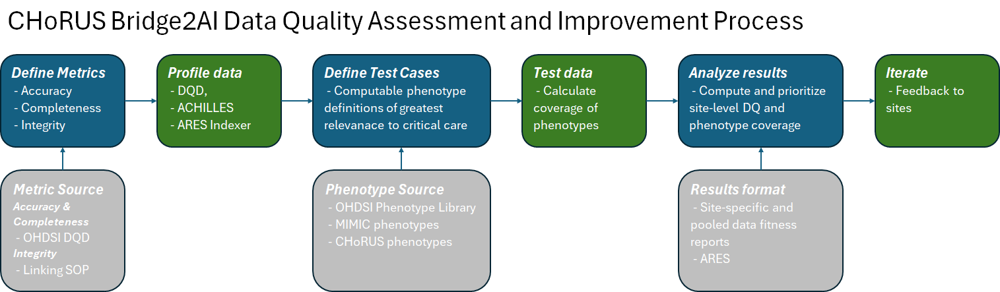

# Approved
# Standard Operating Protocol for Reporting Extract Quality Back to Sites

# Purpose

This SOP defines the multistep process used in CHoRUS Bridge2AI to ensure that released versions of the data are of sufficient accuracy, completeness, and consistency for the development of AI/ML algorithms that help improve recovery from acute illness.

This investigation is semi-automated, and is supported by an [R package](https://github.com/chorus-ai/CHoRUSReports) that generates reports with a well-defined format and content.

Reports are created for each data submission and returned to sites shortly after submission. Data sites should review this report closely and implement any suggested changes prior to their subsequent data submission.

In general, the reports serve to implement the following workflow:

# Audience

This SOP is meant to inform anyone who seeks to understand the process used to assure the quality of the CHoRUS Bridge2AI dataset and to guide anyone involved in that process about the required resources and activities.

# Scope

This SOP is exclusively focused on a high-level description of the data quality process and related activities. Details are provided by links to other documents. It is not focused on the Relevance of the data (prioritizing data elements to include in the dataset) or with assessing coverage of prioritized data elements. But there is overlap between Relevance and the relevance of the data and the data feedback report does include a combination of data quality and coverage of prioritized data elements.

## Structure of Report

### Section 1: Metadata and Comparison with Prior Deliveries

- Metadata about delivery
  - Date and time delivered
  - Packet size
  - Number of prior deliveries
  - Feedback from most recent delivery

- Table with counts & percentages, with cells colored from red to green
  - \# files delivered
  - \# standard data quality check pass/fail & severity
  - \# potential issues with PHI per modality
  - \# chorus-specific quality checks with severity
  - \# CHoRUS-specific characteristics
  - …

- Target \# of patients to be contributed from site
  - \# and % of target patients with any data overall and by modality (+delta from previous submission)
  - \# and % of target patients with complete data overall and by modality (+delta from previous submission)
  - \# and % of target patients with complete and quality approved data overall and by modality (+delta from previous submission)
  - \# and % of target patients with complete and quality approved and deidentified data overall and by modality (+delta from previous submission)
  - \# and % of target patients who conform with the general CHoRUS cohort definition

- Table with count differential from prior delivery
  - Tables will be created as csv files stored alongside the delivery directory for reference and calc of diff

### Section 2: PHI / Deidentification Checks Across Modalities

- Table with findings from OMOP-Based PHI Checks
- Table with findings from Imaging PHI Checks
- Table with findings from Waveform PHI Checks
- Table with findings from Note PHI checks

### Section 3: OMOP Data Quality

- Format similar to report proposed by Claire, with drilldown on failed checks and additional context
- Integrate CHoRUS-specific checks in the same format

### Section 4: CHoRUS Characterization

- \# and % of concepts of interest and delta from last time
- Patients that fall into select phenotypes of interest
- Visit grouping and richness

### Section 5: Comparison with Consortium

- Re-package some of the Ares network overviews and place into the report, highlighting the respective datasite
  - How many events per domain
  - Unmapped concepts
  - Number of releases and subjects

## Codebase and Deployment of the Report

### CHoRUSReports

The reports are created using a standard R package, which is based on the [CdmInspection](https://github.com/EHDEN/CdmInspection) package created for the European Health Data and Evidence Netowrk (EHDEN) consortium.

This package is available on GitHub, and is maintained and updated according to guidelines specified in the [chorus-developer](https://chorus-ai.github.io/chorus-developer/) documentation.

### chorus-container-apps -> chorus-reports

Practically, the CHoRUSReports package gets built into a [Docker image](https://github.com/chorus-ai/chorus-container-apps/pkgs/container/chorus-reports) that can be deployed on Azure (or locally, should sites wish to do so).

This Docker image, named `chorus-reports`, is triggered with each data submission and generates a report that can be returned to the respective data site.

---

## Related Office Hours

The following office hour sessions provide additional context and demonstrations related to this SOP:

- **[07-13-2023] Achilles Output Demo**
  - [Video Recording](https://drive.google.com/file/d/177zdt7EKyN5w3Q2_dgWLxWwNM9VQpmDl/view?usp=sharing) | [Transcript](https://docs.google.com/document/d/1xB9LclJ2A1Q6iwsQbTvGgvhW6vQ32rbg/edit?usp=sharing&ouid=104468275537210259794&rtpof=true&sd=true)
  - Demonstration of Achilles output analysis and interpretation

- **[09-07-2023] ARES usefulness for ETL at Tufts**
  - [Video Recording](https://drive.google.com/file/d/1bSiJLrYkvWRILe4HDBP50htg3YiQhF54/view?usp=sharing) | [Transcript](https://docs.google.com/document/d/1k5ohM-y7JvdXFOmgxqwe0Wouxkl_JeG7/edit?usp=sharing&ouid=104468275537210259794&rtpof=true&sd=true)
  - Practical application of ARES for ETL evaluation

- **[12-07-23] How to contribute Achilles and DQD results to the CHoRUS enclave (part 1)**
  - [Video Recording](https://drive.google.com/file/d/1tijaa-HjC1WQmFJQEyrAtFa-s1IGMdkE/view?usp=sharing) | [Transcript](https://docs.google.com/document/d/1vof_EQP9raFU24lh7PsZ_OjH7SxmM9m-/edit?usp=sharing&ouid=104468275537210259794&rtpof=true&sd=true)
  - Process for contributing quality assessment results to central CHoRUS

- **[01-09-25] Troubleshooting critical data quality issues after recent data ingestion**
  - [Video Recording](https://drive.google.com/file/d/1ARzCkdZ7fKfWCNnv50NBesP_Z2O0Jv6d/view?usp=sharing) | [Transcript](https://docs.google.com/document/d/1G45weHCy9s2XMn1Sj34aRqwPLkXoMOFU/edit?usp=sharing&ouid=104468275537210259794&rtpof=true&sd=true)
  - Addressing quality issues identified in central data processing
