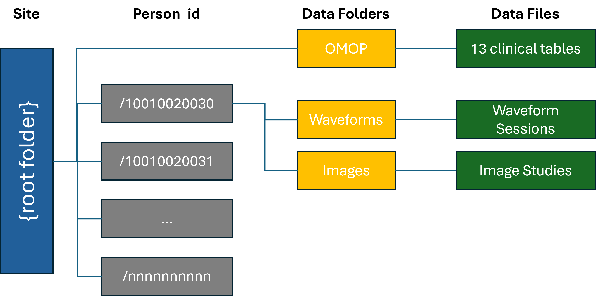
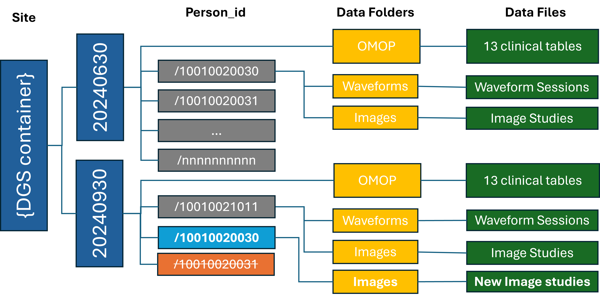

# APPROVED

# Purpose

The motivation of this Standard Operating Procedure (SOP) is to provide a tool to track a data generating site (DGS)'s file repository, identify changed files, and submit the changed files to the central CHoRUS cloud repository.  Two primary motivations for this SOP are

1. **Versioning of submitted data**. Any file from any prior submission should be accessible by CHoRUS users. This implies all past versions of files are tracked, and a database allows query for past versions.
2. **Minimize the data upload** to only added and modified files.  Note that deleted DGS files are only marked and never removed from central storage.

Versioning of the DGS-submitted data and therefore the central dataset is critical for auditing, provenance, and reproducibility.

This SOP specifies the expected processes for managing site data, uploading to the central CHoRUS cloud environment, the change-tracking process, and the submission process. This SOP describes
1.	The required local data structure for DGSs
2.	The central data structure  (INFORMATIONAL)
3.	The data submission process

The SOP aims to simplify the process for submission package preparation and the actual submission.  A python based tool (`chorus-upload`) has been created to provides 2 primary functionalities:  dataset **journaling**, and file **upload**.

## Terms and abbreviations
- SOP: Standard Operating Procedure
- DGS: Data generating site
- Local: Refers to DGS's own storage or data.  Note that this could be on-premise or in DGS's own cloud.
- Staging: Refers to central CHoRUS storage or data in the DGS specific container in the Azure cloud

## Related SOPs:
- Data-Request
- Imaging-Data
- Waveform-Data
- Multimodal-Linkage

# Tooling and Automation

## Upload Mechanisms
CHoRUS data files may be uploaded to the cloud using one of two mechanisms:  `chorus-upload`, or Azure Data Share.   The `chorus-upload` tool can upload using its integrated Azure Python SDK routines or via a generated az-cli script, both executed via commandline.  Azure Data Share is available to DGS that stores local data in its own Azure account, and is configured to automatically pull changed files into CHoRUS cloud staging storage.

The difference between the upload methods are as follows:
- `chorus-upload` with internal routines supports multithreading.
- `chorus-upload` generates a script that uses the Azure CLI tools (`azcli`) which may be useful for DGSs that have already security reviewed `azcli` tools.
- Azure Data Share does not require DGS local user actions.  The dataset journaling task will be performed in cloud, but an additional copy of the staged files will incur a 2X storage footprint.  File deletion tracking is not supported.


## Prerequisites
The `chorus-upload` tool has the following assumptions
1. The DGS has a local on-prem or in-cloud storage.  A DGS may use different storage for each of the data modalities, e.g. images in AWS and waveform and OMOP files in on-prem file system.
2. The DGS may choose to maintain all files in the local storage (`full` mode), or only the new and updated files since last submission (`append` mode) to reduce local space usage.  
3. The DGS will organize the files using the folder structure as described in the [Local File Organization](#local_file_organization) section below.

Please note that `full` mode is recommended as it supports tracking file deletion and can facilitate data QC.  File deletions are not tracked with Azure Data Share regardless of whether `full` or `append` mode is chosen.

## Local File Organization

This SOP and the `chorus-upload` tool scans a DGS's data folder structure to generate a journal (aka manifest) as an SQLite file, which is stored in the DGS's Central cloud container.  Each scan updates the SQLite with additions, deletions, and modifications, and tracks the time of the change.  The scan requires a consistent folder structure and therefore it is CRITICAL for the DGS to adhere to the local folder structure.  The tool can be configured to scan in `full` or `append` mode.


The DGS-local Folder Structure should be organized into the structure as shown below.  The Update tool expects the organizational structure below for identifying the changed file sets:




Each DGS shall maintain data files in the folder structure shown above for either `full` or `append` mode storage. The root folder shall contain an `OMOP` folder, and patient folders named by DGS's de-identified patient IDs.  Each patient directory should contain an `Images` folder and a `Waveforms` folder. 

### Existing Data Uploaded with Different Folder Structure

Each DGS is required to organize the data files in this folder structure.  For DGSs who have previously uploaded data with a different folder structure, it is recommended that the DGS first locally re-organize the data and then use the `chorus-upload` tool to RESUBMIT all existing data.

### Marking files as deleted
(Not applicable to Azure Data Share) In `full` mode, files removed from the folder structure will be considered `deleted`.  In `append` mode, a DGS user can manually supply a list of files to be marked as deleted.  

### OMOP EHR Folder
This folder shall include structured and unstructured 13 OMOP clinical data files(exluding specimen table) as found here (https://ohdsi.github.io/CommonDataModel/cdm54.html#Clinical_Data_Tables). We are not requiring actual notes to be included in the "note_text" field of the NOTE table, but since working with the NOTE_NLP table would greatly benefit from access to foreign keys only present in the NOTE table. Thus the note table should at least contain core identifiers (note_id), descriptors (note_type_concept_id and note_class_concept_id) as well as there foreign keys to PERSON, VISIT_OCURRENCE, VISIT_DETAILS. Each of these table will be in the form of comma delimited files with header rows.

Each OMOP file should contain records for ALL ACTIVE patients submitted to CHoRUS to date. The OMOP files are a complete snapshot of current DGS local CHoRUS OMOP tables.  

### Images Folder
The `Images` folder should contain all images for the patient, with images organized in standard DICOM hierarchy with study/series folders.

Folder and File names should follow the format below:

* Patient Identification: Typically includes a de-identified person ID.
* Modality: Refers to the type of equipment used for the scan, such as MR (Magnetic Resonance), CT (Computed Tomography), XR (X-ray), or US (Ultrasound).
* Accession Id: The Accession number, may be a de-identified version of DICOM tag AccessionNumber (0008,0050).
* Series Id: The series Id, may be a de-identified version of DICOM tag SeriesInstanceUID (0020,000E).
* Instance Number: Represents the specific image number within a series, InstanceNumber (0020,0013).

Example of a DICOM Image folder and filenames
```
root
  ├── 10001001
      ├── Images
          ├──CT
              ├── 1234
                  ├── 5678
                      ├── 000.dcm
                      ├── 001.dcm
                      ├── 002.dcm
                  ...
```

This example would represent a CT scan for patient 1000100020 with Accession Number 1234 and Series Id 5678, with instance numbers 000, 001, and 002. Please make sure that these fields match the dicom metadata tags.

> **Deprecated**: The following descriptions were from the previous versions of the data upload SOP and have been superseded.
>
> (First Upload)
>
> PatientID/Images/StudyID/SeriesId/PatientID_StudyID_SeriesID_Modality_InstanceNumber.dcm
> **Optional**: Inclusion of patient id, study id, and series id in the filename helps to recover orphaned files but is optional.
>
>
> (Initial SOP)
>
> File names should follow the format below:
>
>* Patient Identification: Typically includes a person ID.
>* Study Date: The date when the study was conducted, usually in the format YYYYMMDD.
>* Study Time: The time of the study, often in HHMMSS format.
>* Modality: Refers to the type of equipment used for the scan, such as MR (Magnetic Resonance), CT (Computed Tomography), or US (Ultrasound).
>* Series Number: Indicates the sequence of a particular series of images in a study.
>* Instance Number: Represents the specific image number within a series.
>
>Example of a DICOM Image Name
>```
>PersonID_20230101_101530_CT_01_001.dcm
>```
>
>This example would represent a CT scan for a patient, conducted on January 1, 2023, at 10:15:30. This image is the first in its instances and the first in that series. Make sure instance and series match with dicom metadata.

### Waveforms Folder

The `Waveforms` folder should contain all waveforms for the patient organized into `session` folders, each session containing a set of files corresponding to a continuous recording session. 

Waveform data refers to all data acquired from bedside monitors and devices, including alarms, numerics data obtained at regular or irregular intervals, and high-frequency (>1 Hz) waveform data such as digitized EKG tracings. The waveforms should be deidentified.   For Y1 submission, WFDB file format is recommended but not required. 

See the [Waveform File Format SOP](https://chorus-ai.github.io/Chorus_SOP/docs/Waveform-Data/Waveform-File-Format/#2-file-structure) for the correct and up-to-date folder structure and naming convention.

session_id is a unique identifier that can be chosen by sites to represent a single collection of waveforms.


> **Deprecated**: 
> 
> Previously, the following structure was recommended, similar to the Waveform SOP but lacking the Telemetry/EEG layer:
>
> PatientID/Waveforms/SessionId/PatientID_SessionID\{_fileID\}.extension
>
> 
> The following description was from the initial data upload SOP and has been superseded.
>
>Files should be named using the following format:
>
>* Patient Identification: A unique person ID, typically a number or numeric digits from OMOP Person Table.
>* Start Date: The date when the waveform data was recorded, in the format YYYYMMDD.
>* Start Time: The start time of the recording, in HHMMSS format.
>* Duration in Seconds: The duration of the recording in seconds.
>
>Example File Name
>```
>1000001_20230101_101530_3600.h5
>```
>
>This example represents a recording for patient 1000001 on January 1, 2023, starting at 10:15:30, with a duration of 3600 seconds.

### Local versioning
Sites may wish to separately maintain prior versions of OMOP files at their own discretion (we strongly recommend doing so).  A prescribed organization or naming convention is not provided.  Note also that all previously submitted OMOP files will remain in the Central Staging area.

Currently, the `chorus-upload` tool does not explicitly support placing the files to be submitted in a dated directory, e.g. [root folder] of the form "20241101", but this can be handled by changing the configuration file for chorus-extract-update, IF `append` mode is chosen.


### Example Local Folder Structure

Example folder and file structure for a single patient is shown below:
```
root
  ├── OMOP
      ├── ...
  ├── 10001001
      ├── Images
          ├── 1234
              ├── 5678
                  ├── 10001001_1234_5678_CT_000.dcm
                  ├── 10001001_1234_5678_CT_001.dcm
                  ├── 10001001_1234_5678_CT_002.dcm
                  ...
      ├── Waveforms
          ├── 10001001_901234
              ├── 10001001_901234.hea
              ├── 10001001_901234_layout.hea
              ├── 10001001_901234_0001.hea
              ├── 10001001_901234_0001.dat
              ├── 10001001_901234_0002.hea
              ├── 10001001_901234_0002.dat
              ...
```

This structure shall be maintained for all submissions.  All additions, deletions, and modifications shall be made in this structure.  

A relaxation of the folder structure is that OMOP, images, and waveforms files may be stored in separate file systems.  For example, images may be stored in the AWS cloud, while waveforms may be stored in an on-prem Linux file system.  Each file system shall maintain the same organization, for example:

for example AWS S3 bucket:
```
root
  ├── /10001001
      ├── Images
          ├── 1.2.840.113619.2.176.3596.6358730.30068.1592383800.1.1
              ├── 1.2.840.113619.2.176.3596.6358730.30068.1592383800.2.1
                  ├── 10001001_20220401_113120_CT_01_0.dcm
                  ├── 10001001_20220401_113120_CT_01_1.dcm
                  ├── 10001001_20220401_113120_CT_01_2.dcm
                  ...
```


## Central Staging File Organization
This virtual environment is hosted in an Azure platform. The containers structure is setup such that each DGS has its own container (e.g. mgh).  The container name for each DGS is used in the `config.toml` files as `[DGS_container]` in the [Configuration](#configuration) section.


### Central Staging Folder Structure (INFORMATIONAL)
The submitted data will be organized using the same folder structure as the DGS local file store, except that data for each submission will placed in a top level folder named with a timestamp of the format `YYYYMMDDhhmmss`.  The folder structure is shown here for context.  The timestamped folder will be created automatically by the `chorus-upload` tool.  



In the diagram above, the gray directories were added, blue folder has modifications, and orange folder has been deleted.


# Data Preparation and Upload Process

## For Azure Data Share Users

1. The DGS local data shall be organized according to the [File Organization](#file-organization) section.
2. The Azure Data Share shall be configured to copy data into a "staging" folder in the DGS container.
3. (INFORMATIONAL) The staging data will be scanned to create/update a journal database (by `chorus-upload`) and copied to the a dated directory monthly.

## For Current AZ CLI Users

The `chorus-upload` tool is required for sites that are not using Azure Data Share.  

The code is available in [chorus-extract-upload](https://github.com/chorus-ai/chorus-extract-upload) repository.

### Installation and Usage

> **MOVED** Please refer to [Readme.md](https://github.com/chorus-ai/chorus-extract-upload/edit/main/README.md) for installation and usage instructions.


## Alternatives Considered
Alternative approaches considered for versioning include

1. Azure Blob Storage's versioning: it does not support concurrent access of multiple data versions by multiple users without explicit downloading.
2. Azure Blob Storage's snapshots: snapshots are timestamped, but identifying files that belong to a time frame for public data release is difficult.
3. Azure Blob Storage soft delete: soft delete allows deleted files to be accessed, but is time limited, and does not support versioning or timestamp.
4. Git Large File Storage: git based file versioning but would require full checkout to access a past version.

Alternative approaches to minimize data movement include
1. azcopy, rsync:  these methods reduce data transmission to changed set, but do not track past history or deleted files.
2. Azure Data Share:  current approach copies files to ensure CHoRUS maintains control over submitted data; moving changed set renders it similar to rsync and azcopy. 

<!-- 
TODO: file organization verification
TODO: DONE change "manifest" to "journal"
illustration of the upload process and creation of the timestamp.
 -->

