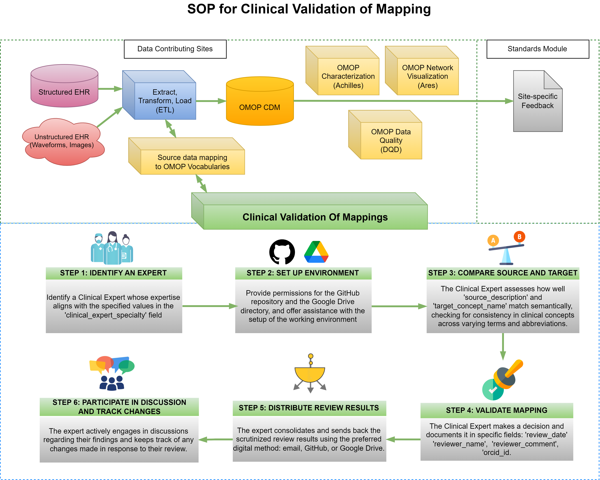

# Approved
#  Standard Operating Protocol for Clinical Validation of Mappings

# Purpose

This SOP outlines a comprehensive framework for the mappings' clinical validation process, which is essential for maintaining the integrity of data translations. It aims to foster effective collaboration among diverse experts by offering detailed guidelines, methodologies, and precise definitions tailored to guide clinical experts through complex mapping scenarios and review mechanisms. The ultimate goal of this document is to enhance the quality of harmonized data in healthcare research, ensuring that it accurately represents authentic clinical semantics and practices.

---
## STEP 1: IDENTIFY AN EXPERT
After selecting the mappings for validation, identify a Clinical Expert whose expertise matches the values listed in the **'clinical_expert_specialty'** column in the **'flowsheets-exactMatchesWExpertSpecialty'** tab of the [Delphi R2 T1&2: Mapping Clinical Validation - Collaborative Workspace](https://docs.google.com/spreadsheets/d/1EH61Y1xuNxei6CT_VcU0AeYY88Gk5aYExaF6THhzQ1U/edit?usp=sharing) Google Spreadsheet (path: Google Drive CHoRUS Standards Module > Mappings > Delphi > Delphi R2 T1&2: Mapping Clinical Validation - Collaborative Workspace).

## STEP 2: SET UP ENVIRONMENT
Grant permissions for the GitHub repository and the Google Drive directory to the relevant team members.
Additionally, assist with the setup of the working environment as needed. Ensure that the expert is informed about the clinical validation [Guide](https://github.com/chorus-ai/chorus-mapping/tree/mapping_dev/Docs/MappingClinicalValidation) available here, on GitHub. It is crucial that they familiarize themselves with this guide to streamline the validation process.

## STEP 3: COMPARE SOURCE AND TARGET
The Clinical Expert compares the semantic content of two fields: "source_description" and "target_concept_name". Their evaluation will determine the extent to which these fields convey the same clinical concept, despite potential differences in terminology, syntax, or abbreviation.
### Scenarios for Decision Making
1) **Equivalent Concepts and Correct Mapping**: If the expert concludes that both fields articulate the same clinical idea to the same clinical meaning, despite variations in wording such as synonyms, acronyms, or word order, they should enter "1" in the "decision" field.
2) **Divergent Concepts and Incorrect Mapping**: If the expert finds that the fields convey different meanings, suggesting an erroneous mapping, they should enter "2" in the "decision" field.
3) **Introduction of New Mapping**: If the expert proposes a new mapping, they should add it by inserting a new row(s) accordingly.

## STEP 4: VALIDATE MAPPING
The Clinical Expert documents his/her/their decision in designated fields: 
| Field Name | Description | Example |
|------------------|------------------|------------------|
| `review_date` | Captures the date of the review | 03-25-2024 |
| `reviewer_name` | Records the expert’s name | John Doe |
| `reviewer_comment` | Includes any additional notes | While cardiac sound is a rarely used term, the two concepts can be interchangeable semantically |
| `reviewer_specialty` | The clinical expert’s specialty | Cardiologist |
| `orcid_id` | Provides the expert's unique identifier, if applicable | N/A |
| `status` | The current status of the review process related to the mapping. This field is used to track the progress and discussions needed before finalizing the decision | Under validation |
| `site_name` | The official name of Clinical Expert's site | Columbia University |

## **STEP 5: DISTRIBUTE REVIEW RESULTS**
The expert consolidates and sends back the scrutinized review results using the preferred digital method: email, [GitHub](https://github.com/chorus-ai/chorus-mapping-stage), or [Google Drive](https://drive.google.com/drive/u/4/folders/1R-8PQ8PUV1aSQyDGQ0O4ltP11Ycco6lM).

## **STEP 6: PARTICIPATE IN DISCUSSION AND TRACK CHANGES**
The expert actively engages in discussions regarding their findings and keeps track of any changes made in response to their review.

To assess baseline agreement among experts regarding questionable mappings, the second phase of clinical validation will address terms that initially did not receive a clear verdict. This will be done through double-blind validation.
